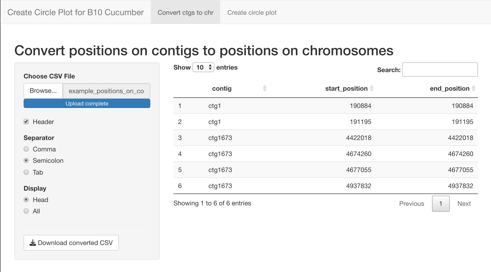
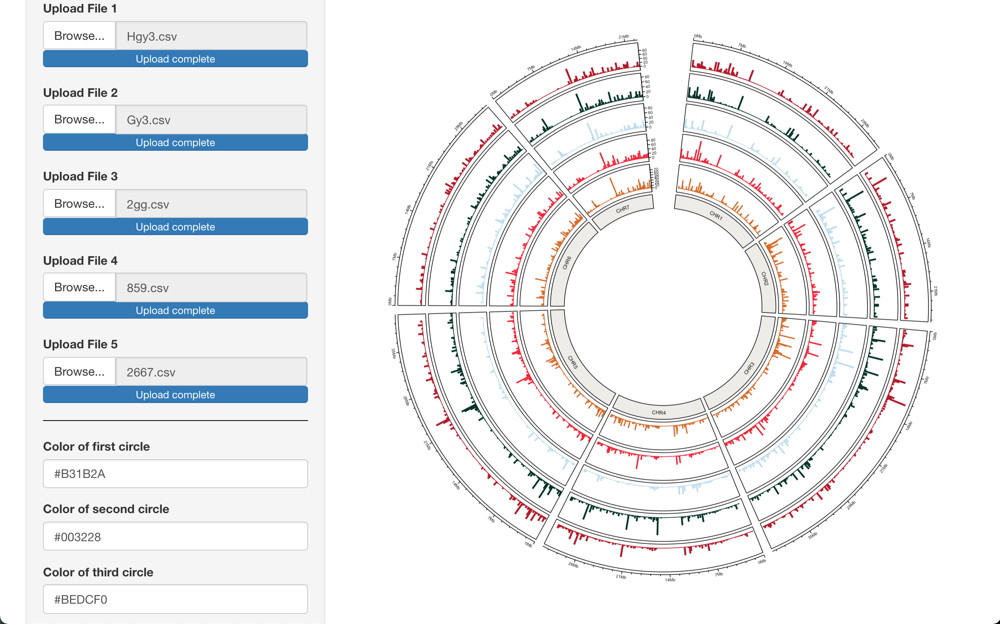

# Circle plot app
The Shiny application has been developed to enable the creation of circle plots for the B10 cucumber genome. In the first tab, positions on contigs are translated into positions on chromosomes, while in the second tab, a circle plot is created.
## Screenshots

## Instruction:
The first step is to import a CSV file containing information about the location on the genome (genes, SNPs, etc.).

| contig | start_position | end_position |
|----------|----------|----------|
| ctg1    | 190884     | 190884     |
| ctg1673    | 4422018     | 4422018     |

The next step is to load the downloaded file with chromosome positions into the next tab, where we select the number of files and colors corresponding to HEX values.
The application allows you to upload up to 7 files with positions on genomes. The application allows you to download visualisations in PDF format. The demo data catalog contains a sample file containing an input file with positions on contigs and three files containing SNP positions on chromosomes.

##Info
The script was prepared as part of the National Science Center project UMO-2020/37/B/NZ9/00586.

